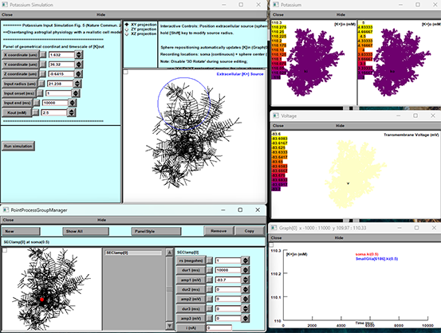

# ASTRO Fig 5 K⁺ Dynamics in Fully Reconstructed Four CA1 Astrocytes

## Description

This package implements the model described in *Savtchenko et al. (2018, Nature Communications)*, Figure 5, simulating extracellular K⁺ accumulation and clearance in a network of four fully reconstructed CA1 astrocytes using the ASTRO builder.

## Requirements

- **NEURON** v7.8 or later (with Python support)  
- **Python** 3.7+

## Installation

1. Install NEURON with Python bindings (see [https://nrn.readthedocs.io](https://nrn.readthedocs.io)).  
2. Clone or unzip this folder into your working directory.  
3. From within the `mechanisms/` directory, compile the MOD files. With recent NEURON versions, you can do this by running `nrnivmodl MOD_files` from a terminal in the top-level directory.

> **Note:** Ensure that your `PYTHONPATH` or Python virtual environment includes NEURON’s `lib/python` directory.

## Usage

1. Open a terminal in the top-level directory.  
2. Launch NEURON’s GUI with the initialization script:

   ```
   nrngui init.hoc
   ```

3. You will see several windows/panels:

### Potassium Input Simulation  
- Located on the left.  
- Enter your extracellular K⁺ source parameters:
  - **X, Y, Z** coordinates (µm)  
  - **Input radius** (µm)  
  - **Input onset** (ms) and **end** (ms)  
  - **[K⁺]out** (mM)  
- 
  Click **Run simulation** once your sphere is positioned.



### 3D Morphology View  
- Center panel.  
- Displays reconstructed astrocyte morphology and the K⁺ source sphere.

### Potassium Panel  
- Top-right.  
- Two heatmaps:
  - `[K⁺]in (mM)` inside the cell  
  - `[K⁺]o (mM)` outside the cell  
- Color scale updates in real time.

### Voltage Panel  
- Middle-right.  
- Membrane voltage (mV) across the morphology.

### Graph[0] Panel  
- Bottom-right.  
- Time-series plot of selected variables (e.g., soma [K⁺]in vs. [K⁺]o).

### PointProcessGroupManager  
- Bottom panel.  
- Lists SEClamp or other point processes; control buttons available here.

4. Position your spherical K⁺ source by either:  
   - Typing new coordinates/radius in the **Potassium Input Simulation** panel, or  
   - Clicking and dragging the sphere in the **3D Morphology View** (hold **Shift** to resize).

5. Once your stimulus is set, press **Run simulation**.  
6. Watch the **Potassium**, **Voltage**, and **Graph[0]** panels update to show how extracellular [K⁺] drives changes in membrane voltage and intracellular [K⁺].

